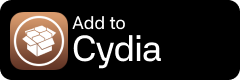
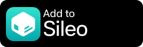
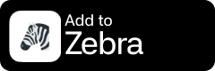
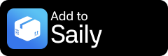
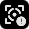
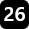

## Add the repository

In your package manager, add this source:
    
https://strayfade.github.io/tweaks/

###

## Packages

| Name | Description |
|------|-------------|
|  netsocket | Compatibility with netsocket service |
|  SensorUsageLog | Detailed sensor usage monitor with application rankings |
|  LSText | Custom, positionable lock screen text |
|  SplashText | Minecraft-style splash text near the lock screen clock |
|  ShareClipboard | Shares the clipboard between iOS and a Windows PC on the same network |
|  ScreenMirroring | Backport of iPhone Mirroring from newer versions of iOS/MacOS |
|  Liquid Glass | Backports iOS 26 Liquid Glass visuals and Settings cell styling |